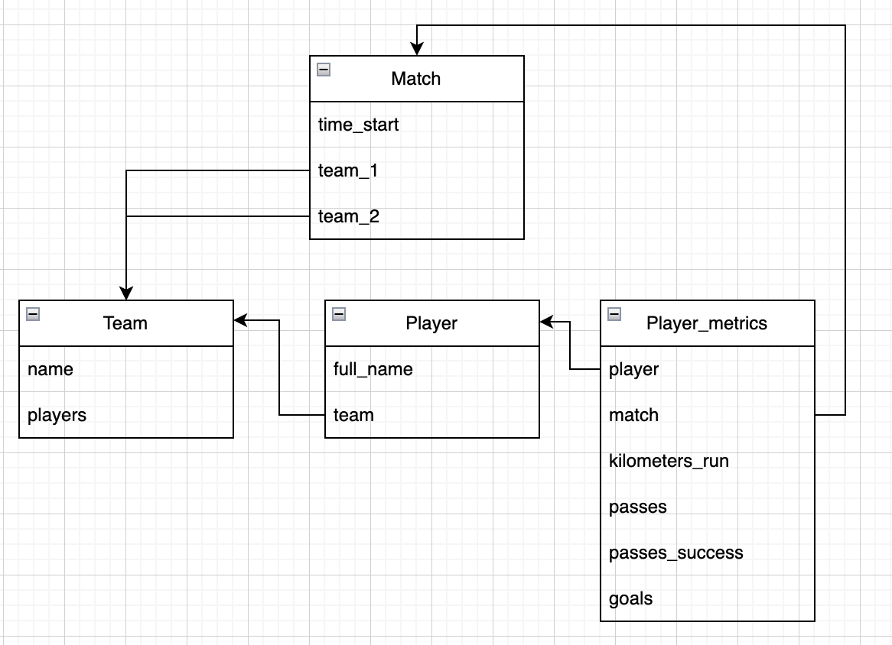

# Тестовое задание

## БД postgresql, модели:
-футбольная команда\
-игроки\
-матчи\
-характеристики игрока за матч


## Функции:
-заполнение показателей по характеристикам\
-имеется ли показатель у конкретного игрока за последние 5 матчей\
-топ 5 игроков по конкретному показателю в команде\
-топ 5 игроков по конкретному показателю по всем игрокам

## Покрыто тестами Rspec + shoulda-matchers + factory_bot


# Первый запуск
```
make build
```

# Запустить/остановить
```
make start
make stop
```

# Зайти в консоль
```
make console
```

# Схема


